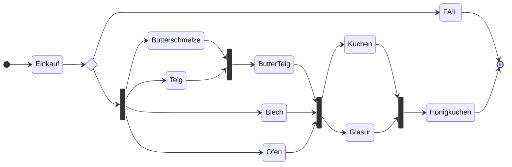

# Service Orchestration

Webflux vs. CoRoutines vs. Camunda vs. Kafka

---
transition: slide-up
---
# In der Weihnachtsbäckerei


---

# Spring Webflux

```java {all|1,3-4,9-10,12-18,21,23|2,5-8,11,19-20,22}
public Mono<Honigkuchen> backeHonigkuchen(Zutaten vorhandeneZutaten) {
  return einkaufen(vorhandeneZutaten)
      .zipWhen(
          zutaten -> zip(
              honigMitButterSchmelzen(zutaten.getHonig(), zutaten.getButter()),
              teigVorbereiten(zutaten.getMehl()),
              blechEinbuttern(zutaten.getButter()),
              ofenVorheizen()
          ).zipWhen(
              schmelzeTeigBlechOfen -> 
                  schmelzeInTeigRuehren(schmelzeTeigBlechOfen.getT1(), schmelzeTeigBlechOfen.getT2()),
              (schmelzeTeigBlechOfen, butterTeig) ->  //Tuple of Tuple deconstruction via BiFunction
                  of(butterTeig, schmelzeTeigBlechOfen.getT3(), schmelzeTeigBlechOfen.getT4())
          ),
          (zutaten, butterTeigBlechOfen) ->  //Tuple of Tuple deconstruction via BiFunction
              of(zutaten, butterTeigBlechOfen.getT1(), butterTeigBlechOfen.getT2(), butterTeigBlechOfen.getT3())
      ).zipWhen(
          vorbereitungen -> zip(
              glasurVorbereiten(vorbereitungen.getT1().getZucker()),
              backen(vorbereitungen.getT2(), vorbereitungen.getT3(), vorbereitungen.getT4())),
          (vorbereitungen, kuchenGlasur) -> 
              new Honigkuchen(kuchenGlasur.getT1(), kuchenGlasur.getT2()));}
```

---

# Kotlin Coroutine
  
```kotlin {all|1,2,17|4-16}
fun backeHonigkuchen(vorhandeneZutaten: Zutaten) = 
  mono {
    // Businesscode wiederverwendbar und portierbar auf android, quarkus, liberty, aws lambda, node.js, usw.
    val zutaten = einkaufen(vorhandeneZutaten)

    val butterschmelze = async { honigMitButterSchmelzen(zutaten.honig, zutaten.butter) }
    val teig = async { teigVorbereiten(zutaten.mehl) }
    val blech = async { blechEinbuttern(zutaten.butter) }
    val ofen = async { ofenVorheizen() }

    val butterTeig = async { schmelzeInTeigRuehren(butterschmelze.await(), teig.await()) }

    val kuchen = async { backen(ofen.await(), butterTeig.await(), blech.await()) }
    val glasur = async { glasurVorbereiten(zutaten.zucker) }

    Honigkuchen(kuchen.await(), glasur.await())
  }
```

---

# Camunda


---

# Kafka Java
```java {all|3-6|8-11|13-16|17}
    public void eventHandler() {
        // TODO missing SerDes
        KStream<String, Zutaten> zutaten = builder.stream("einkaufen-topic");
        zutaten.mapValues(value -> new Teig(value.getMehl())).to("teigVorbereiten-topic");
        zutaten.mapValues(value -> new Butterschmelze(value.getHonig(), value.getButter())).to("honigMitButterSchmelzen-topic");
        zutaten.mapValues(value -> new Blech(value.getButter())).to("blechEinbuttern-topic");

        KStream<String, Teig> teig = builder.stream("teigVorbereiten-topic");
        KStream<String, Butterschmelze> butterschmelze = builder.stream("honigMitButterSchmelzen-topic");
        KStream<String, Blech> blech = builder.stream("blechEinbuttern-topic");
        KStream<String, Ofen> ofen = builder.stream("ofenVorheizen-topic");

        KStream<String, Kuchen> kuchen = ofen.join(butterschmelze
        .join(teig, ButterTeig::new, joinWindows)
        .join(blech, ButterTeigBlech::new, joinWindows),
        Kuchen::new, joinWindows);
        kuchen.to("kuchen-topic");
        // ... Glasur Stream ... Honigkuchen Stream
        }
```